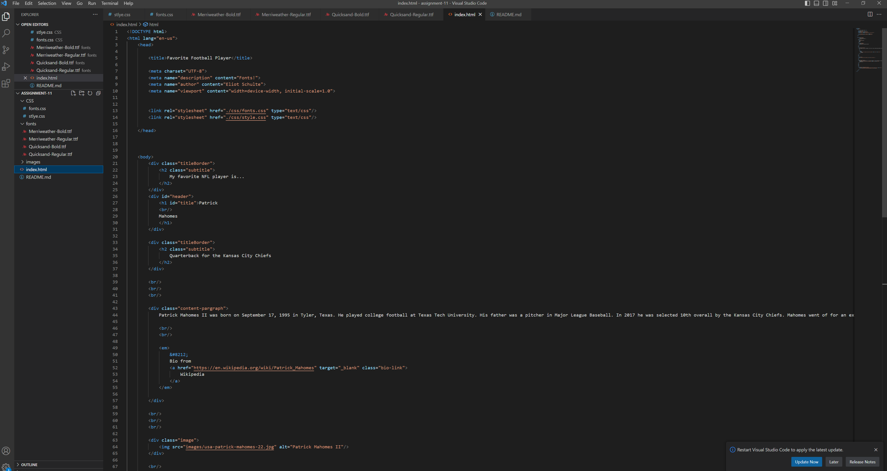

Poor internet connection might prevent a font from loading. In any font loading failure scenario, that is when having a fallback font comes in handy.

Web fonts offer a great alternative to web safe fonts because they are hosted on the web and then downloaded by the browser while rendering the web page. 
System fonts are fonts that are already installed on your computer.

